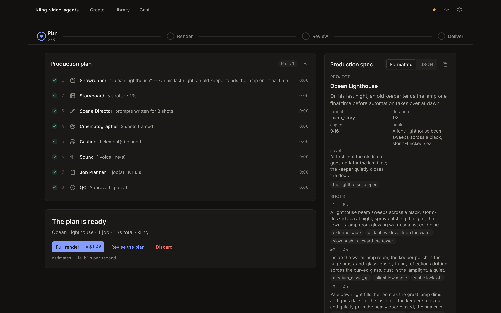

# Filmcrew Studio

**One line in, a multi-shot short film out — planned by a crew of 8 AI agents, rendered on fal.ai, stitched on your machine.**

Type a single idea — *"a lighthouse keeper's last night before automation"* — and an 8-agent LLM pipeline (Showrunner → Storyboard → Scene Director → Cinematographer → Casting → Sound → Job Planner → QC) writes a full production spec you can read and edit before spending a cent. fal.ai renders the planned shots on **Kling 3.0 Omni** or **Seedance 2.0**, your recurring characters keep a consistent look and speak their lines in a voice minted once, and ffmpeg stitches the finished `.mp4` locally into `out/`. A QC agent re-runs only the sub-agents whose work failed, so the plan is sound before any paid frame renders. Local-first and MIT-licensed: rendering is **paid pay-as-you-go on fal.ai**, you bring your own LLM planner (Claude, OpenAI, Gemini, or Copilot), and nothing is ever posted anywhere — it just writes a local file.

[](https://github.com/mali90/filmcrew-studio/actions/workflows/test.yml)
[](LICENSE)
[](https://nodejs.org)

> [!NOTE]
> Everything runs on your machine and writes a local video file only — nothing is ever posted anywhere.
> Unofficial community project; not affiliated with Kuaishou / Kling AI or ByteDance / Seedance.



**See it in action** — real short films made with the tool, on the **Jolly Dots** channels:

[](https://www.youtube.com/@JollyDots)
[](https://www.instagram.com/_jolly_dots/)
[](https://www.tiktok.com/@jolly_dots)

## Get started

You need four things (**the app checks all of them for you** and walks you through any that are missing):

- **Node.js 20+** — the LTS build from <https://nodejs.org> (22+ for the Copilot planner).
- **ffmpeg** — stitches the clips. The setup wizard shows the one-line install for your OS.
- **A fal.ai key** — renders the video (pay-as-you-go). <https://fal.ai/dashboard/keys>
- **One AI planner** — Claude, OpenAI, Gemini, or Copilot, via an API key or a logged-in CLI.

Then:

```bash
npm install && npm run web:install
npm --prefix web/ui run build
npm run web
```

The browser opens **http://127.0.0.1:5177** and, on first run, a setup wizard takes over: it connects your planner and fal key (validating them live), picks your defaults, writes `.env` for you, and runs a health check where **every failed check carries its own fix** — nothing ends in an error you have to google.

From there: type an idea → the agents plan it (uses your LLM, no render spend) → you see the **price on every render button** before anything spends → review the cut clip by clip → request changes (they go back through the agents) → approve, with an optional Topaz upscale to 1080p. Your finished `.mp4` lands in **`out/`**.

> [!IMPORTANT]
> Rendering is **paid, pay-as-you-go** on fal.ai. The studio shows an estimate on every money button and renders economically by default (Kling ~720p / Seedance 480p — the approve-time upscale delivers 1080p). Long videos split into several render jobs, and those plans offer a **probe** — render just the first job to check the direction before paying for the rest. Details and current prices: [docs/COST.md](docs/COST.md).

### Starting and stopping, day to day

- **Start:** `npm run web` — the browser opens by itself (`WEB_NO_OPEN=1` to disable).
- **Stop:** Settings → Application → **Shut down** (or Ctrl+C in its terminal).
- **Restart** (picks up `.env` and updates): Settings → Application → **Restart** — the page reconnects on its own.
- Give recurring characters a face and a voice on the **Cast** page, then star them in any idea.

## Prefer the terminal?

The same pipeline is fully drivable as CLIs:

```bash
npm run engine -- --brief "your idea here" --render           # plan it and render it
npm run engine -- --brief "your idea here" --render --probe   # long multi-job videos: render only the first job first
```

| Command | What it does |
|---|---|
| `npm run doctor` | Health check (keys, ffmpeg, and everything a render needs). |
| `npm run engine -- --brief "..." --render` | Plan a one-line idea and render it. Add `--probe` (multi-job plans: first job only), `--upscale`, `--backend seedance`, `--cast <names>`; drop `--render` for the plan only. |
| `npm run revise -- --from runs/<id> --feedback "..."` | Send director feedback back through the owning agents. |
| `npm run render-job -- --from runs/<id> --job K2` | Re-render one job as a new take (seam-chained). |
| `npm run render -- --spec <spec.json>` | Render an existing plan. |
| `npm run assemble -- --from runs/<id>/renders/<take>` | Finish or re-stitch a prior render — free, no API calls. |
| `npm run mint-voice -- <name> <clip.mp3>` | Give a character a persistent voice (once per character). |

Two video models: **Kling 3.0 Omni** (default) and **Seedance 2.0** — pick per run with `--backend`, or set the default in Settings. How they differ: [docs/PROVIDERS.md](docs/PROVIDERS.md). Slow, hand-held setup (including editing `.env` yourself): [docs/SETUP.md](docs/SETUP.md).

## What you get

- **An 8-agent planning engine** with a QC gate that re-runs only the agents whose work fails — the plan is sound before a single paid frame renders.
- **Two render backends** behind one spec — any plan renders on either.
- **Characters that persist**: reference images, subject bibles and minted voices, managed on the Cast page and starrable per idea. A sample character, **Wren**, ships in the box — open the Cast page or add `--cast wren` to any idea to try it (activate his voice with `npm run mint-voice -- "Wren" voices/wren.mp3`).
- **Honest money UX**: a price on every render button, first-job probes on multi-job plans, free re-assembly, upscale only when you choose it.
- **Review like an editor**: per-clip strip with take history, scoped re-renders with seam-cascade warnings, change requests that re-run the engine.
- **A fully mocked test suite** — every test runs without keys, network, or spend.

## See it in action

Every clip on the **Jolly Dots** channels was planned by the 8-agent crew and rendered on fal.ai — the same pipeline in this repo, no manual editing beyond what the tool stitches automatically.

[](https://www.youtube.com/@JollyDots)
[](https://www.instagram.com/_jolly_dots/)
[](https://www.tiktok.com/@jolly_dots)

New films go up regularly — subscribe on [YouTube](https://www.youtube.com/@JollyDots) to follow along.

## How it works

```
   your idea (one line)
          │  8 small AI "agents" plan the movie (story, shots, camera, cast, sound, QC)
          ▼
   ENGINE ──▶ RENDER ──▶ STITCH ──▶  out/your-video.mp4  🎬
              (fal.ai)   (ffmpeg — clips over 15s are chained + seam-faded automatically)
```

| # | Agent | What it decides |
|---|-------|-----------------|
| 0 | Showrunner | The overall idea and tone |
| 1 | Storyboard | The sequence of timed shots |
| 2 | Scene Director | What happens in each shot |
| 3 | Cinematographer | Camera angles, movement, framing |
| 4 | Casting | Which subjects and reference images to use |
| 5 | Sound | Audio and any spoken lines |
| 6 | Job Planner | Packs shots into render jobs within the model's limits |
| 7 | QC | Checks the plan end to end; re-runs whoever failed |

A worked example lives in [`examples/ocean-lighthouse/`](examples/ocean-lighthouse) — the brief and the full spec the agents produced from it.

## Cost

Rendering is **paid, pay-as-you-go** on fal.ai — every render spends money. These figures are a **snapshot as of July 2026 and may change** — always check fal's pricing for your endpoint. Full detail (hard limits, the probe workflow, the Seedance token formula): [docs/COST.md](docs/COST.md).

| Model / step | Output | Price (July 2026) | Typical 15s job |
|---|---|---|---:|
| **Kling o3 — Standard** · default | ~720p | $0.112/s | ≈ $1.68 |
| **Kling o3 — Pro** · `FAL_KLING_ENDPOINT` | 1080p | $0.14/s | ≈ $2.10 |
| **Seedance 2.0** · 480p (default) | 480p | $0.14/s | ≈ $2.00 |
| **Seedance 2.0** · 720p | 720p | $0.30/s | ≈ $4.50 |
| **Seedance 2.0** · 1080p | 1080p | $0.68/s | ≈ $10.20 |
| **Topaz upscale** · `--upscale` | → 1080p | $0.12/s · one job per sub-1080p clip | ≈ $1.80 |
| **Voice mint** · `mint-voice` | one voice / character | ≈ $0.007 once | — |

> **Snapshot — see [docs/COST.md](docs/COST.md) for current detail.** The default for both backends is *render small + Topaz upscale on approve*, so the finished master is 1080p while you pay the economical tier's per-second rate.

## Docs

- [docs/SETUP.md](docs/SETUP.md) — manual setup, custom characters, config reference
- [docs/PROVIDERS.md](docs/PROVIDERS.md) — video models, planners, `.env` options
- [docs/COST.md](docs/COST.md) — model limits and current prices
- [web/README.md](web/README.md) — web app architecture (for contributors)
- [CHANGELOG.md](CHANGELOG.md)

## Contributing & support

Questions and bugs → [GitHub issues](https://github.com/mali90/filmcrew-studio/issues); run `npm run doctor` first and include its output. Contributions welcome — the entire test suite (host, server, UI, e2e) runs with **zero keys, network, or spend**, so you can develop everything against mocks: `npm test`, `npm --prefix web/server test`, `npm --prefix web/ui run test`, and `npm --prefix web/ui run e2e` (Playwright starts its own fully mocked server). See [web/README.md](web/README.md).

## License

MIT — see [LICENSE](LICENSE).
