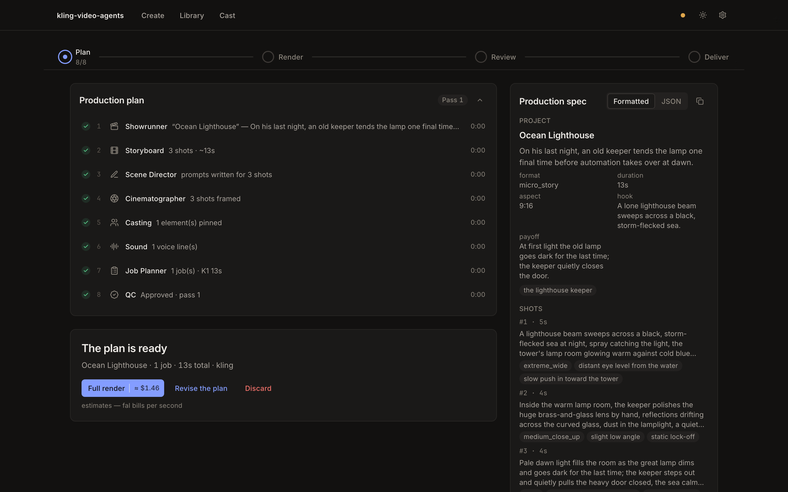

# Filmcrew Studio

**One line in, a multi-shot short cinematic film out — planned by a crew of 8 AI agents, rendered on fal.ai or Segmind, stitched on your machine.**

Type a single idea — *"a lighthouse keeper's last night before automation"* — and an 8-agent LLM pipeline (Showrunner → Storyboard → Scene Director → Cinematographer → Casting → Sound → Job Planner → QC) writes a full production spec. **fal.ai or Segmind** renders the planned shots on **Kling 3.0**, **Seedance 2.0** or **Seedance 2.5**, your recurring characters keep a consistent look and speak their lines in a voice minted once, and ffmpeg stitches the finished `.mp4` locally into `out/`. A QC agent re-runs only the sub-agents whose work failed, so the plan is sound before any paid frame renders. Local-first and source-available (FSL-1.1, converts to MIT after two years): rendering is **paid pay-as-you-go** at whichever provider you pick, you bring your own LLM planner (Claude, OpenAI, Gemini, or Copilot), and nothing is ever posted anywhere — it just writes a local file.

[](https://github.com/mali90/filmcrew-studio/actions/workflows/test.yml)
[](LICENSE)
[](https://nodejs.org)

> [!NOTE]
> A video file is downloaded on your machine — nothing is ever posted anywhere.
> Unofficial community project; not affiliated with Kuaishou / Kling AI or ByteDance / Seedance.



**See it in action** — real short films made with the tool, on the **Jolly Dots** channels:

[](https://www.youtube.com/@JollyDots/shorts)
[](https://www.instagram.com/_jolly_dots/)
[](https://www.tiktok.com/@jolly_dots)

## Get started

**Node.js is the only thing you install yourself — the app handles the rest in your browser.** No fal key, no ffmpeg, no config files to wrangle up front: the first-run wizard collects, validates, and saves all of that for you.

**1. Get Node.js** *(already have it? skip this)*

Run `node -v`. If it prints **v20 or higher**, you're set — jump to step 2. (The GitHub Copilot planner needs **v22+**; the LTS installer below covers that too.)

<details>
<summary><b>Don't have Node? Install it — macOS / Windows</b></summary>

<br>

**macOS** — with [Homebrew](https://brew.sh):

```bash
brew install node
```

…or download the **LTS** installer from <https://nodejs.org>.

**Windows** — with winget:

```powershell
winget install OpenJS.NodeJS.LTS
```

…or download the **LTS** installer from <https://nodejs.org>.

Reopen your terminal and confirm with `node -v` (want v20+; v22+ recommended, required for Copilot).

</details>

**2. Run it**

```bash
npm install && npm run web:install
npm --prefix web/ui run build
npm run web
```

Your browser opens to **http://127.0.0.1:5177**, where a first-run wizard takes over. It walks you through your **AI planner** — Claude, OpenAI, Gemini, or Copilot, via an API key or a logged-in CLI (it can even one-click install the planner's CLI for you; you still log in yourself) — and your **fal.ai key**, **live-validating** each, sets your defaults, and **writes `.env` for you**. It closes on a health check: if **ffmpeg** is missing, it shows you the **exact one-line command** to install it for your OS (you run that command — the app never modifies your system). **Every failed check carries its own fix**, so nothing ends in an error you have to google.

From there: type an idea → the agents plan it (uses your LLM, no render spend) → you see the **price on every render button** before anything spends → review the cut clip by clip → request changes (they go back through the agents) → approve, with an optional Topaz upscale to 1080p. Your finished `.mp4` lands in **`out/`**.

> [!IMPORTANT]
> Rendering is **paid, pay-as-you-go** on fal.ai or Segmind. The studio shows an estimate on every money button and renders economically by default (Kling ~720p / Seedance 2.0 480p — the approve-time upscale delivers 1080p). Segmind runs the same Seedance models for about half fal's per-second rate. Where a rate isn't on file at all, the button says **"Price not set"** and warns instead of blocking; the render still costs money. Long videos split into several render jobs, and those plans offer a **probe** — render just the first job to check the direction before paying for the rest. Details and current prices: [docs/COST.md](docs/COST.md).

### Starting and stopping, day to day

- **Start:** `npm run web` — the browser opens by itself (`WEB_NO_OPEN=1` to disable).
- **Stop:** Settings → Application → **Shut down** (or Ctrl+C in its terminal).
- **Restart** (picks up `.env` and updates): Settings → Application → **Restart** — the page reconnects on its own.
- Give recurring characters a face and a voice on the **Cast** page, then star them in any idea.
- Describe a reusable **environment** — a world, mood and palette in words — once on the **Cast** page, then set any idea in it.

## Prefer the terminal?

The same pipeline is fully drivable as CLIs:

```bash
npm run engine -- --brief "your idea here" --render           # plan it and render it
npm run engine -- --brief "your idea here" --render --probe   # long multi-job videos: render only the first job first
```

| Command | What it does |
|---|---|
| `npm run doctor` | Health check (keys, ffmpeg, and everything a render needs). |
| `npm run engine -- --brief "..." --render` | Plan a one-line idea and render it. Add `--probe` (multi-job plans: first job only), `--upscale`, `--backend seedance`, `--cast <names>`, `--environment <name>`; drop `--render` for the plan only. |
| `npm run revise -- --from runs/<id> --feedback "..."` | Send director feedback back through the owning agents. |
| `npm run render-job -- --from runs/<id> --job K2` | Re-render one job as a new take (seam-chained). Pin either end to a neighbour with `--first-frame-from` / `--last-frame-from`, and send edited words with `--prompt-overrides`. |
| `npm run render -- --spec <spec.json>` | Render an existing plan. |
| `npm run assemble -- --from runs/<id>/renders/<take>` | Finish or re-stitch a prior render — free, no API calls (unless you pass `--upscale`, or have `UPSCALE_ENABLED=true` in your `.env`: either one adds a paid Topaz pass over every sub-1080p clip in it). |
| `npm run mint-voice -- <name> <clip.mp3>` | Give a character a persistent voice (once per character). |

Three video models across two providers: **Kling 3.0** (default, fal-only), **Seedance 2.0** and **Seedance 2.5** — the two Seedance models render on **fal.ai or Segmind**, your choice. Pick per run with `--backend`, or set the default in Settings. Backends are named `<model>@<provider>` (`kling-o3@fal`, `seedance-2.0@fal`, `seedance-2.5@fal`, `seedance-2.0@segmind`, `seedance-2.5@segmind`); the old one-word `kling`/`seedance` names still work everywhere, including in specs already on disk. You only need a key for the provider you render on — a **Segmind-only install needs no fal account at all**. How they differ, and what a Segmind-only setup can and can't do: [docs/PROVIDERS.md](docs/PROVIDERS.md). Slow, hand-held setup (including editing `.env` yourself): [docs/SETUP.md](docs/SETUP.md).

## What you get

- **An 8-agent planning engine** with a QC gate that re-runs only the agents whose work fails — the plan is sound before a single paid frame renders.
- **Five render backends across two providers** behind one spec, each planned to **its own model's caps** — job window, reference-image budget, starred-cast ceiling (Kling 1, Seedance 2.0 2, Seedance 2.5 4) and aspect-ratio list. The caps follow the *(model, provider)* pair, so the same model can offer more on one vendor than the other. Over-cap choices are refused before any paid step.
- **Characters that persist**: reference images, subject bibles and minted voices, managed on the Cast page and starrable per idea. A sample character, **Wren**, ships in the box — open the Cast page or add `--cast wren` to any idea to try it (activate his voice with `npm run mint-voice -- "Wren" voices/wren.mp3`).
- **Environments that persist**: a purely descriptive world/mood/palette bible (`environments/<slug>.md`, no images or voice), managed on the Cast page and set per idea to steer every shot's look. A sample environment, **Neon City**, ships in the box — open the Cast page or add `--environment neon-city` to any idea to try it.
- **Seam-invisible stitching**: a video over the model's window renders as several chained jobs, and the local stitch colour-matches each chained joint, drops the frame the two clips share and crossfades — so a long cut reads as one take instead of popping at every seam. Pure local ffmpeg, no API and no spend; optional (`pip3 install numpy pillow`), and without it the plain hard-cut stitch still runs. [docs/STITCHING.md](docs/STITCHING.md)
- **Honest money UX**: a price on every render button, first-job probes on multi-job plans, free re-assembly, upscale only when you choose it.
- **Review like an editor**: per-clip strip with take history and a chip on every join saying whether the two clips actually run together, scoped re-renders that can be pinned to the clip on either side, change requests that re-run the engine. **See the exact prompt each clip is sent, and edit it** — metered in the bytes the model counts, with the system's share re-composed at render time so your words go out verbatim ([docs/PROMPTS.md](docs/PROMPTS.md)); saving an edit is a local file write and spends nothing.
- **Approved is not the end**: a delivered run can be reopened for changes, and until it is, the server itself refuses to spend on it. Your delivered file stays on disk — a later approval writes a new one beside it and keeps the history.
- **A fully mocked test suite** — every test runs without keys, network, or spend.

## See it in action

Every clip on the **Jolly Dots** channels was planned by the 8-agent crew and rendered on fal.ai — the same pipeline in this repo, no manual editing beyond what the tool stitches automatically.

[](https://www.youtube.com/@JollyDots)
[](https://www.instagram.com/_jolly_dots/)
[](https://www.tiktok.com/@jolly_dots)

New films go up regularly — subscribe on [YouTube](https://www.youtube.com/@JollyDots) to follow along.

## How it works

```
   your idea (one line)
          │  8 small AI "agents" plan the movie (story, shots, camera, cast, sound, QC)
          ▼
   ENGINE ──▶ RENDER ──▶ STITCH ──▶  out/your-video.mp4  🎬
              (fal.ai)   (ffmpeg — clips over 15s are chained, then seam-matched automatically)
```

| # | Agent | What it decides |
|---|-------|-----------------|
| 0 | Showrunner | The overall idea and tone |
| 1 | Storyboard | The sequence of timed shots |
| 2 | Scene Director | What happens in each shot |
| 3 | Cinematographer | Camera angles, movement, framing |
| 4 | Casting | Which subjects and reference images to use |
| 5 | Sound | Audio and any spoken lines |
| 6 | Job Planner | Packs shots into render jobs within the model's limits |
| 7 | QC | Checks the plan end to end; re-runs whoever failed |

A worked example lives in [`examples/ocean-lighthouse/`](examples/ocean-lighthouse) — the brief and the full spec the agents produced from it.

## Cost

Rendering is **paid, pay-as-you-go** at your render provider — every render spends money. These figures are a **snapshot as of July/August 2026 and may change** — always check the provider's pricing for your endpoint. Full detail (hard limits, the probe workflow, the Seedance token formula): [docs/COST.md](docs/COST.md).

| Model / step | Output | Price (fal Jul 2026 · Segmind Aug 2026) | Typical 15s job |
|---|---|---|---:|
| **Kling o3 — Standard** · default | ~720p | $0.112/s | ≈ $1.68 |
| **Kling o3 — Pro** · `FAL_KLING_ENDPOINT` | 1080p | $0.14/s | ≈ $2.10 |
| **Seedance 2.0** · 480p (default) | 480p | $0.14/s | ≈ $2.00 |
| **Seedance 2.0** · 720p | 720p | $0.30/s | ≈ $4.50 |
| **Seedance 2.0** · 1080p | 1080p | $0.68/s | ≈ $10.20 |
| **Seedance 2.5** · 480p | 480p | $0.2205/s | ≈ $3.31 |
| **Seedance 2.5** · 720p (default) | 720p | $0.473/s | ≈ $7.10 |
| **Topaz upscale** · `--upscale` | → 1080p | $0.08/s at 9:16 · tiered by output frame · one job per sub-1080p clip | ≈ $1.20 |
| **Voice mint** · `mint-voice` | one voice / character | ≈ $0.007 once | — |
| **Seedance 2.0 on Segmind** · 480p (default) | 480p | $0.0703/s | ≈ $1.05 |
| **Seedance 2.5 on Segmind** · 720p (default) | 720p | $0.2389/s | ≈ $3.58 |
| **Topaz upscale on Segmind** · `--upscale` | → target | $0.125/s flat · on the input duration | ≈ $1.88 |

> **Snapshot — see [docs/COST.md](docs/COST.md) for current detail.** The default for the fal backends is *render small + Topaz upscale on approve*, so the finished master is 1080p while you pay the economical tier's per-second rate. Rows without a provider are fal's.

> **Segmind runs the same Seedance models at about half fal's rate** (2.0 also does 720p at $0.1512/s, 1080p at $0.34/s, 4k at $1.3721/s; 2.5 does 480p at $0.1065/s and publishes no 1080p or 4k tier). **These renders still cost real money** — Segmind bills in credits, and the balance it reports after each job is what actually left your account. Details in [docs/PROVIDERS.md](docs/PROVIDERS.md).

## Docs

- [docs/SETUP.md](docs/SETUP.md) — manual setup, custom characters, config reference
- [docs/PROVIDERS.md](docs/PROVIDERS.md) — video models, planners, `.env` options
- [docs/COST.md](docs/COST.md) — model limits and current prices
- [docs/PROMPTS.md](docs/PROMPTS.md) — what gets sent per clip, the byte budgets, and editing it
- [docs/STITCHING.md](docs/STITCHING.md) — how the clips become one video (seamless vs hard-cut seams)
- [web/README.md](web/README.md) — web app architecture (for contributors)
- [CHANGELOG.md](CHANGELOG.md)

## Contributing & support

Questions and bugs → [GitHub issues](https://github.com/mali90/filmcrew-studio/issues); run `npm run doctor` first and include its output. Contributions welcome — the entire test suite (host, server, UI, e2e) runs with **zero keys, network, or spend**, so you can develop everything against mocks: `npm test`, `npm --prefix web/server test`, `npm --prefix web/ui run test`, and `npm --prefix web/ui run e2e` (Playwright starts its own fully mocked server). See [web/README.md](web/README.md).

## License

**Source-available** under the [Functional Source License 1.1 (FSL-1.1-MIT)](LICENSE) — read, run, modify, and contribute freely for any non-competing purpose. You may not use it to build a competing commercial product or hosted service. Each release automatically becomes MIT-licensed two years after it ships. See [fsl.software](https://fsl.software) for the rationale.
