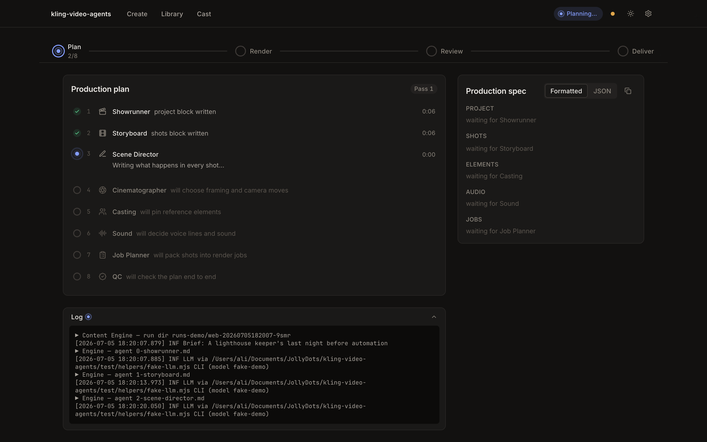

# The web app



A localhost studio UI over the CLI pipeline — type one line, watch the 8-agent engine write the
plan, render it on Kling or Seedance, review every clip, request changes (they go back through the
engine), then approve with an optional Topaz upscale. Nothing here is a second pipeline: the server
spawns the same CLIs you run by hand, and every state the UI shows is derived from the artifacts on
disk (`runs/`), so a restart recovers every run from disk. (The work queue itself is in-memory: an interrupted child is flagged for recovery on the run page, but queued-not-yet-started work must be re-triggered.)

```
npm run web                    # http://127.0.0.1:5177 — serves the built UI + API on one port
node web/server/dev/demo.js    # http://127.0.0.1:5178 — dev harness: mock fal + fake LLM, zero spend
```

Install and build once before `npm run web`: `npm run web:install && npm --prefix web/ui run build` (from the repo root).
For UI development: `npm --prefix web/ui run dev` (Vite on 5173, proxying `/api` to 5177).

## Layout

```
web/
  shared/api-types.ts   the single source of truth for API shapes (UI imports it; server mirrors it)
  server/               Fastify 5, plain ESM + JSDoc, tested with node:test
    app.js              buildApp() factory — all deps injectable (fastify.inject tests)
    lib/                run-scan (disk→status), run-service (orchestration), job-manager (CLI
                        children in 3 FIFO lanes), ring-log, artifact-watch, estimator, env-settings
    routes/             setup/settings/doctor · runs · actions · media (range-served) · SSE · cast · environments
    dev/demo.js         the zero-spend dev server (mock fal + fake LLM; drives the Playwright e2e)
  ui/                   React 18 + TypeScript + Tailwind (CSS-variable tokens), vitest + Testing
                        Library + MSW, Playwright e2e; fonts vendored locally (no CDN)
```

## Principles

- **Plan before spend.** Creating a run only plans (LLM cost ≈ cents). Every money-bearing button
  carries its estimated price (`≈ $4.20`); estimates come from `web/server/lib/prices.json` —
  editable ballparks, clearly labeled, never billing.
- **Artifacts are truth.** Run status is derived by `run-scan.js` from what exists on disk
  (`spec-NN.json`, clips, `render.json`, masters) plus the small per-run `web.json` manifest
  (lineage, costs, approval). No database; restart-safe by construction.
- **Stitch precedes review.** A full render ends assembled; probes and job re-renders are
  auto-assembled (free) the moment clips land — the review player always has a current master.
  Approve only finalizes (and optionally Topaz-upscales below 1080p).
- **Children, not imports.** The host `config.js` freezes env at import, so all engine/render/doctor
  work runs as spawned CLIs with a minimal env — they re-read `.env` fresh, which is why settings
  changes apply without restarting the server.
- **One SSE stream per run** (`snapshot` first, then typed events; `Last-Event-ID` resumes log
  lines) + one global stream (queue, run status). Progress is never a fake percentage.

## API

See `web/shared/api-types.ts` for shapes. Routes: `GET /api/health`, setup
(`/api/setup/status|validate-llm|validate-fal`), settings (`/api/settings/env[/preview]|defaults`),
`POST /api/doctor`, `GET /api/storage`, runs CRUD (`/api/runs[/:id]`, `spec`, `log?cursor`,
`estimate`), actions (`render|revise|rerender-job|assemble|approve|cancel|dismiss-error|plan|reveal`), SSE
(`/api/runs/:id/events`, `/api/events`), media (`/api/media/runs/*|out/*|elements/*`, range-served),
cast (`/api/cast/characters|references|voices|profiles`, profile CRUD via
`POST/PUT/DELETE /api/cast/profiles[/:slug]`, asset linking via
`POST /api/cast/references/:id/assign` and `POST /api/cast/voices/:key/assign`),
environments (`GET /api/environments`, descriptive-only setting CRUD via
`POST /api/environments` and `PUT/DELETE /api/environments/:slug`; a run's optional
`environment` slug is validated against disk before any LLM spend).
Errors are always `{error, hint}`.
`POST /api/runs/:id/assemble` also accepts a `{composition: {jobId: takeId}}` body to stitch a
mixed cut from existing takes without re-rendering — an API-level feature for now (the UI's
re-render flow composes cuts automatically).

## Testing

```
npm --prefix web/server test     # unit (status derivation, queue, sentinels, estimator, paths)
                                 # + integration (fastify.inject over the REAL CLIs with the mock
                                 #   fal server + fake LLM in tmp dirs — full loops, SSE, media)
npm --prefix web/ui test         # vitest + Testing Library + MSW component/page tests
npm --prefix web/ui run e2e      # Playwright (chromium) — starts dev/demo.js itself, zero spend
```

Everything runs without keys, network, or spend. The only paid path is the one you click yourself
in the real app.
