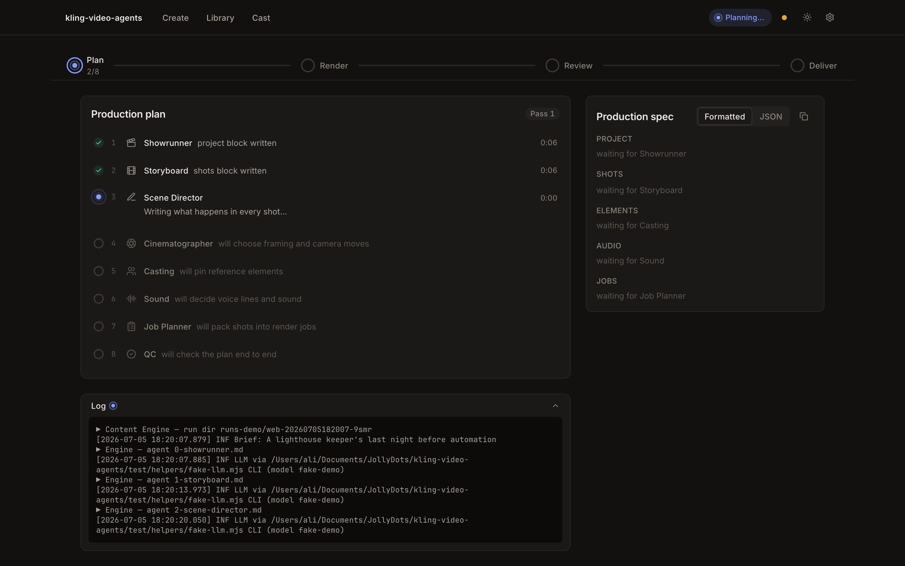

# The web app



A localhost studio UI over the CLI pipeline — type one line, watch the 8-agent engine write the
plan, render it on Kling or Seedance, review every clip, request changes (they go back through the
engine), then approve with an optional Topaz upscale. Nothing here is a second pipeline: the server
spawns the same CLIs you run by hand, and every state the UI shows is derived from the artifacts on
disk (`runs/`), so a restart recovers every run from disk. (The work queue itself is in-memory: an interrupted child is flagged for recovery on the run page, but queued-not-yet-started work must be re-triggered.)

```
npm run web                    # http://127.0.0.1:5177 — serves the built UI + API on one port
node web/server/dev/demo.js    # http://127.0.0.1:5178 — dev harness: mock fal + fake LLM, zero spend
```

Install and build once before `npm run web`: `npm run web:install && npm --prefix web/ui run build` (from the repo root).
For UI development: `npm --prefix web/ui run dev` (Vite on 5173, proxying `/api` to 5177).

## Layout

```
web/
  shared/api-types.ts   the single source of truth for API shapes (UI imports it; server mirrors it)
  shared/render-models.ts  typed facade over src/lib/render-models.js and src/lib/seam-rule.js —
                        per-model labels, cast caps, aspect lists and the seam rule itself, so the UI
                        never re-declares a cap or re-implements a join's strength in TypeScript
  server/               Fastify 5, plain ESM + JSDoc, tested with node:test
    app.js              buildApp() factory — all deps injectable (fastify.inject tests)
    lib/                run-scan (disk→status), run-service (orchestration), job-manager (CLI
                        children in 3 FIFO lanes), ring-log, artifact-watch, estimator, env-settings,
                        lineage (pure per-joint continuity from recorded seams), prompt-service
                        (prompt preview + the overrides sidecar; itself lazy-imported by the routes,
                        and it lazy-imports the composer so no engine module joins the static graph)
    routes/             setup/settings/doctor · runs · actions · media (range-served) · SSE · cast · environments
    dev/demo.js         the zero-spend dev server (mock fal + fake LLM; drives the Playwright e2e).
                        dev/seed-demo-run.js boots it with a rendered three-segment cut whose middle
                        clip was re-rendered, so the join chips, prompt sheet, re-render dialog and
                        reopen path are one click away — its seam modes come from chooseSeamMode and
                        its sidecars from the server's own composer, so the fixture cannot promise a
                        seam the renderer would not make
  ui/                   React 18 + TypeScript + Tailwind (CSS-variable tokens), vitest + Testing
                        Library + MSW, Playwright e2e; fonts vendored locally (no CDN)
```

## Principles

- **Plan before spend.** Creating a run only plans (LLM cost ≈ cents). Every money-bearing button
  carries its estimated price (`≈ $4.20`); estimates come from `web/server/lib/prices.json` —
  editable ballparks, clearly labeled, never billing.
- **Artifacts are truth.** Run status is derived by `run-scan.js` from what exists on disk
  (`spec-NN.json`, clips, `render.json`, masters) plus the small per-run `web.json` manifest
  (lineage, costs, approval). No database; restart-safe by construction.
- **Stitch precedes review.** A full render ends assembled; probes and job re-renders are
  auto-assembled (free) the moment clips land — the review player always has a current master.
  Approve only finalizes (and optionally Topaz-upscales below 1080p).
- **Finalized means finalized, on the server.** Once a run is approved, `render`, `revise`,
  `rerender-job`, `assemble` and `plan` refuse it with a 409 — the guard lives in `run-service`, not
  in the buttons, so a stale tab cannot spend against a delivered film. `POST /reopen` is the way
  back: it moves one timestamp in the manifest, deletes nothing, and is itself refused while a paid
  upscale is still writing the file being delivered. Every delivery is kept in the manifest's
  `finals` history; "complete" means the approval is newer than the last reopen.
- **A joint is chained by identity, not by a flag.** `lib/lineage.js` is pure: segment *i* continues
  from *i−1* iff the seam it recorded was taken off the clip that is *actually* at position *i−1* in
  this cut. Runs from before seam records existed are replayed from take history and marked
  `confidence: 'derived'`. It shares fixtures with `src/lib/seamstitch.js`, because a stitcher and a
  UI that disagreed about a join would mean one of them is lying. `serializeRun` exposes continuity
  as take/job ids only — never filesystem paths.
- **Children, not imports.** The host `config.js` freezes env at import, so all engine/render/doctor
  work runs as spawned CLIs with a minimal env — they re-read `.env` fresh, which is why settings
  changes apply without restarting the server. A module from `src/` may be imported **statically**
  only if it reads no env and no disk and its own static graph does the same, so pulling it in cannot
  drag `config.js` (and a developer's real `.env`) into the server's graph. That is the whole list:
  `render-models.js` (zero imports), `seam-rule.js` (imports only `render-models.js` — the single
  copy of the seam rule the renderers, this server and the browser bundle all call, so a join cannot
  be described one way here and rendered another), and the `seedance-guidance.js` string constant.
  Everything else is `await import(...)` inside the handler that needs it — that is why
  `prompt-service.js` and the composer behind it are lazy — or lives behind a spawned CLI. Leak-canary
  tests walk the static graph transitively and guard the rule.
- **One SSE stream per run** (`snapshot` first, then typed events; `Last-Event-ID` resumes log
  lines) + one global stream (queue, run status). Progress is never a fake percentage.

## API

See `web/shared/api-types.ts` for shapes. Routes: `GET /api/health`, setup
(`/api/setup/status|validate-llm|validate-fal`), settings (`/api/settings/env[/preview]|defaults`),
`POST /api/doctor`, `GET /api/storage`, runs CRUD (`/api/runs[/:id]`, `spec`, `log?cursor`,
`estimate`), prompts (`GET /api/runs/:id/prompts`, `GET …/prompt?job=K2[&take=t1]`, and editing via
`PUT …/prompt` / `DELETE …/prompt?job=K2`),
actions (`render|revise|rerender-job|assemble|approve|reopen|cancel|dismiss-error|plan|reveal`), SSE
(`/api/runs/:id/events`, `/api/events`), media (`/api/media/runs/*|out/*|elements/*`, range-served),
cast (`/api/cast/characters|references|voices|profiles`, profile CRUD via
`POST/PUT/DELETE /api/cast/profiles[/:slug]`, asset linking via
`POST /api/cast/references/:id/assign` and `POST /api/cast/voices/:key/assign`),
environments (`GET /api/environments`, descriptive-only setting CRUD via
`POST /api/environments` and `PUT/DELETE /api/environments/:slug`; a run's optional
`environment` slug is validated against disk before any LLM spend).
`POST /api/runs` takes a backend id as `<model>@<provider>` (legacy `kling`/`seedance` still
accepted) and rejects — before any child spawns — a cast larger than that model's ceiling or an
aspect ratio the model does not render.
Errors are always `{error, hint}`.
`POST /api/runs/:id/assemble` also accepts a `{composition: {jobId: takeId}}` body to stitch a
mixed cut from existing takes without re-rendering — an API-level feature for now (the UI's
re-render flow composes cuts automatically).
`POST /api/runs/:id/rerender-job` takes `boundaries` — `auto` (default: mirror the joins the cut
already has, never silently repair a broken one) · `both` · `start` · `end` · `none`. In a cascade
the closing pin belongs to the last job in the chain and to no other.
Every spending action returns **409** on a finalized run, with `POST /api/runs/:id/reopen` named as
the way forward; the run's serialized shape carries `continuity` (per joint) and each take's
`promptSource`, and prompt saves/discards arrive on the run stream as a `prompt-override` event.
Reading or editing a prompt spends nothing — no model call, no render — and edits are stored
verbatim in `<runDir>/prompt-overrides.json`; the system's share (style, identity, seam pins) is
never stored, only re-composed at render time. See [../docs/PROMPTS.md](../docs/PROMPTS.md).

## Testing

```
npm --prefix web/server test     # unit (status derivation, queue, sentinels, estimator, paths)
                                 # + integration (fastify.inject over the REAL CLIs with the mock
                                 #   fal server + fake LLM in tmp dirs — full loops, SSE, media)
npm --prefix web/ui test         # vitest + Testing Library + MSW component/page tests
npm --prefix web/ui run e2e      # Playwright (chromium) — starts dev/demo.js itself, zero spend
```

Everything runs without keys, network, or spend. The only paid path is the one you click yourself
in the real app.
